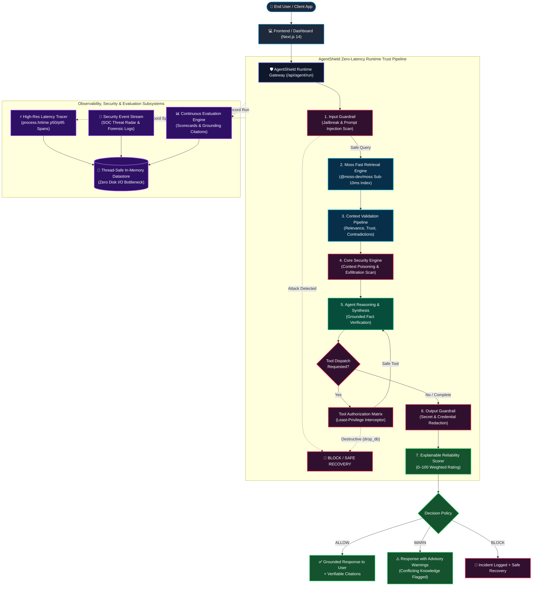

# AgentShield — Architecture Diagram

---

## Component Descriptions

| Subsystem | Function | Latency Target |
|---|---|---|
| **AgentShield Gateway** | HTTP runtime proxy receiving client requests and dispatching to internal verification pipeline. | $< 0.5\text{ms}$ |
| **Input Guardrail** | Scans queries for jailbreaks (`DAN`, developer mode override) and direct instruction overrides. | $< 1.0\text{ms}$ |
| **Moss Retrieval** | In-process vector index (@moss-dev/moss) querying enterprise knowledge bases. | $< 5.0\text{ms}$ |
| **Context Validator** | Validates source provenance, calculates topical relevance, and flags cross-source contradictions. | $< 2.0\text{ms}$ |
| **Security Engine** | Protects against indirect prompt injection embedded in external retrieved text. | $< 1.0\text{ms}$ |
| **Tool Guardrail** | Intercepts destructive system tools (`drop_database`, `delete_table`, `exec_system_cmd`). | $< 1.5\text{ms}$ |
| **Output Guardrail** | Scans model response for leaked secrets (OpenAI keys, database credentials, system prompts). | $< 1.0\text{ms}$ |
| **Reliability Scorer** | Deterministic 7-signal formula producing explainable 0–100 confidence score. | $< 0.5\text{ms}$ |
| **Latency Tracer** | Nanosecond-precision performance counter tracking p50/p95 percentiles across all pipeline spans. | $< 0.2\text{ms}$ |
